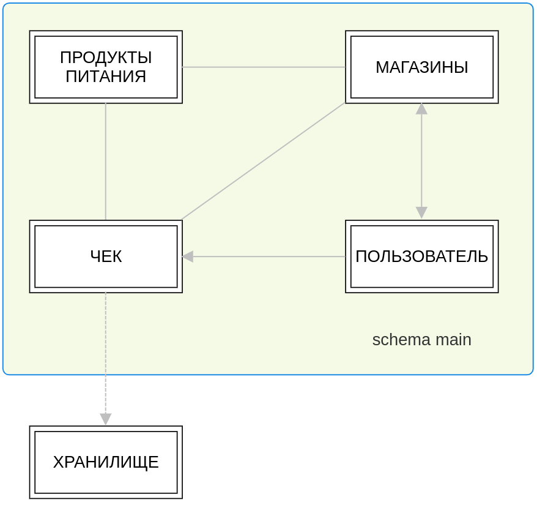

# Лабораторная работа №1 
Тема: Элементы теории баз данных

Группа: М8О-109СВ-24

Выполнил: **Гимазетдинов Дмитрий Русланович**

---

## Этап 1: Планирование Базы Данных

### 1.1 Цель проекта

Целью разработки базы данных является создание надежного хранилища данных для приложения, которое позволяет пользователям вести учет покупок продуктов питания, а также анализировать и прогнозировать расходы. Приложение ориентировано на конечных пользователей, которым важно следить за своими тратами на продукты и планировать их с целью экономии.

### 1.2 Подготовка технических требований

Подготовка технических требований включает в себя определение обязанностей разработчика, описание предоставляемых услуг базой данных и перечень информации, которая будет отслеживаться в системе.

#### Обязанности разработчика

- **Проектирование базы данных:**
  - Создание концептуальной, логической и физической модели данных.
  - Определение схемы данных, включая таблицы, связи между ними, индексы и триггеры.
  
- **Реализация и настройка базы данных:**
  - Развертывание базы данных `Postgres` на удаленном сервере.
  - Настройка производительности (индексирование, оптимизация запросов, шардирование, репликация).
  - Обеспечение резервного копирования и восстановления данных.
  - Создание хранилища, способного выдержать большую историчность данных.

- **Обеспечение безопасности:**
  - Реализация механизмов контроля доступа (роли и права пользователей).
  - Реализация аудитных записей для отслеживания изменений и доступа к данным.

- **Поддержка и обслуживание:**
  - Мониторинг производительности и доступности базы данных.
  - Выполнение обновлений и миграций структуры базы данных.
  - Предоставление технической поддержки пользователям и устранение возникающих проблем.

#### Услуги, предоставляемые базой данных

- **Хранение данных о покупках:**
  - База данных хранит сведения о каждом приобретенном товаре, включая дату покупки, магазин, категорию товара, его стоимость и количество и прочую служебную информацию.

- **Анализ данных:**
  - База данных предоставляет аналитические функции для расчета среднемесячных затрат, распределения расходов по категориям, частоты покупок и других показателей.

- **Прогнозирование расходов:**
  - На основе исторических данных база данных может предоставлять прогнозы будущих расходов, учитывая тенденции и сезонные изменения.

- **Долговременное хранение данных для анализа:**
  - База данных будет интегрирована со специализированным хранилищем данных, которое предназначено для долговременного хранения информации, необходимой для более глубокого анализа и отчетности. Это хранилище будет содержать агрегированные данные, исторические записи, а также результаты аналитических вычислений.

#### Отслеживаемая информация

- **Данные о товарах:**
  - Наименование товара, его категория (например, овощи, фрукты, молочные продукты), цена за единицу, количество, существенные характеристики и т.п.
  
- **Данные о покупках:**
  - Дата и время покупки, место покупки (магазин), общая стоимость покупки, стоимость по акции, время, адресс и т.п.

- **Пользовательские данные:**
  - Профиль пользователя, включая его настройки, бюджетные цели, персональные категории расходов. 

- **Исторические данные:**
  - Хронология покупок, позволяющая отслеживать изменения в поведении пользователя со временем и использовать эти данные для прогнозирования.

- **Аналитические данные:**
  - Агрегированные данные для отчётности, такие как суммарные траты за определённый период, распределение расходов по категориям, а также прогнозы на основе этих данных.

- **Долговременные данные:**
  - В специализированное хранилище данных будут поступать архивные данные, которые сохраняются для аналитических целей на длительный срок. Эти данные будут использоваться для формирования долгосрочных прогнозов, трендового анализа и других сложных аналитических задач.

---

## Этап 2: Сбор и анализ требований

### 2.1 Пользовательские требования (Users' Requirement Specification)

#### 2.1.1 Основные пользовательские сценарии

**1. Ведение учета покупок продуктов питания:**
- **Пользователь** должен иметь возможность добавлять информацию о совершенных покупках в базу данных через приложение.
- **Продукты питания** должны быть классифицированы по категориям (например, овощи, фрукты, молочные продукты и т.д.), чтобы пользователь мог легко их выбирать.
- **Чек** будет автоматически считываться через камеру, по технологии QR-code или ссылку на реестр.

**2. Анализ расходов и планирование бюджета:**
- **Пользователь** должен получать доступ к отчетам, показывающим его расходы за различные периоды (неделя, месяц, год) с возможностью фильтрации по категориям продуктов, магазинам или другим параметрам.
- Приложение должно предоставлять **персонализированные прогнозы расходов** на основе прошлых данных, хранящихся в базе, и предлагать способы экономии, или долговременную тенденцию полученную на основе данных из хранилища.

**3. Управление персональными данными:**
- **Пользователь** должен иметь возможность просматривать и редактировать свои личные данные и контактную информацию.
- Приложение должно обеспечить **конфиденциальность данных**.

**4. Оценка и отзывы:**
- **Пользователь** должен иметь возможность оставлять отзывы и оценки как для продуктов питания, так и для магазинов.
- Отзывы будут храниться в базе данных и использоваться для формирования рейтингов продуктов и магазинов.

**5. Поддержка долговременного анализа:**
- Приложение должно позволять пользователю просматривать **исторические данные о покупках**, сохраняя их в отдельном хранилище для долговременного анализа и прогнозирования.
- **Пользователь** может получать отчеты, основанные на исторических данных, что поможет ему принимать обоснованные решения о своих будущих тратах.

#### 2.1.2 Ограничения

**1. Приватность и безопасность данных:**
- Личные данные и данные о покупках пользователей должны быть **защищены** от несанкционированного доступа, с использованием шифрования и контроля доступа.

**2. Интерактивные и быстрые отчеты:**
- Отчеты и аналитика должны генерироваться **оперативно**, не превышая допустимого времени ожидания, чтобы пользователь мог быстро получить необходимые данные.

**3. Совместный доступ и обмен данными:**
- В рамках приватности пользователь может делиться некоторыми данными, например, отчетами о расходах или списками покупок, с другими пользователями по своему выбору.

#### 2.1.3 Уровни доступа

**1. Пользователь:**
- Доступ к своим личным данным, спискам покупок, отчетам о расходах и персональным настройкам.
- Доступ к историческим данным и возможности их анализа.

**2. Система:**
- Доступ к данным для их обработки, анализа и предоставления отчетов пользователям.
- Доступ к долгосрочному хранилищу для архивирования и анализа исторических данных.

**3. Администратор:**
- Полный доступ ко всей системе, включая управление пользователями, настройками базы данных, правами доступа, резервным копированием и восстановлением данных.

### 2.2 Системные требования (System Specification)

В этом разделе мы рассмотрим основные системные требования, необходимые для реализации функционала, который был описан в пользовательских требованиях. Включим описание ограничений, уровней доступа, а также системные характеристики, такие как структура базы данных, объемы данных, производительность, и требования к поддержке и обслуживанию.

#### 2.2.1 Структура и ограничения системы

**1. Структура базы данных:**
- **Таблицы:**
  - **Продукты питания:** содержит данные о категориях товаров, их характеристиках (белки, жиры, углеводы), пользовательских отзывах и статистике.
  - **Магазины:** хранит информацию о магазинах, включая рейтинг, адреса, ссылки на сайты и отзывы пользователей.
  - **Чек:** включает информацию о покупках, таких как QR-код, цена покупки, список товаров, пользователь, который совершил покупку, и служебную информацию.
  - **Пользователь:** хранит личные данные, контактную информацию и настройки пользователя.
  - **Хранилище:** долговременное хранилище данных с поддержкой "историчности", используемое для анализа и расчета тенденций.

**2. Ограничения:**
- **Доступ к данным:** 
  - Доступ к данным о покупках и персональной информации пользователя должен быть ограничен на основе ролей и прав доступа, чтобы обеспечить защиту конфиденциальности.
  - Только администраторы имеют доступ к настройкам системы и могут управлять пользователями, делать резервные копии и восстанавливать данные.

- **Объем хранимых данных:** 
  - База данных должна быть спроектирована с учетом возможности обработки больших объемов данных, особенно в хранилище, где будет храниться долговременная информация для анализа.
  - Первоначальный объем данных может быть незначительным, но система должна масштабироваться по мере роста количества пользователей и накопленных данных.

- **Производительность:**
  - Время выполнения основных операций (например, добавление покупки, генерация отчетов) должно оставаться в пределах приемлемых значений (не более 5-7 секунд), даже при увеличении объема данных.

#### 2.2.2 Уровни доступа и управление данными

**1. Роли пользователей и уровни доступа:**
- **Пользователь:** 
  - Доступ к собственным данным: покупки, личная информация, настройки.
  - Возможность просмотра, добавления, редактирования и удаления своих данных о покупках и отзывах.
  - Доступ к отчетам и аналитике на основе своих данных.

- **Администратор:**
  - Полный доступ ко всем данным в системе, включая управление учетными записями пользователей, настройками системы, резервным копированием и восстановлением.
  - Возможность мониторинга производительности системы и обеспечения безопасности.

**2. Управление данными:**
- **Хранение и обработка данных:**
  - Данные о покупках должны обрабатываться в режиме реального времени и сразу же сохраняться в базе данных.
  - Исторические данные о покупках будут перемещаться в долговременное хранилище для анализа и расчета тенденций.

- **Архивирование и удаление данных:**
  - Определение сроков хранения данных в оперативной базе данных и периодического переноса в долговременное хранилище для обеспечения производительности.
  - Опции для пользователей по запросу удалять свои данные или их архивировать.

### 2.3 Описание таблиц и связей

Описание структуры базы данных и взаимосвязей между таблицами поможет понять, как будут организованы данные и как они будут взаимодействовать друг с другом. В этом разделе мы рассмотрим каждую таблицу, её поля и связи.

#### 2.3.1 Таблица "Продукты питания"
- **Описание:** Содержит информацию о продуктах питания, их категориях и характеристиках.
- **Поля:**
  - `product_id` (PK): Уникальный идентификатор продукта.
  - `name`: Название продукта.
  - `category`: Категория продукта (например, овощи, молочные продукты).
  - `proteins`: Количество белков на 100 грамм.
  - `fats`: Количество жиров на 100 грамм.
  - `carbohydrates`: Количество углеводов на 100 грамм.
  - `rating`: Средний рейтинг продукта на основе отзывов пользователей.
  - `reviews`: Отзывы пользователей о продукте.

- **Связи:**
  - **Многие ко многим** с таблицей "Чек" (`product_id` -> `product_id` в таблице "Чек_Продукты").
  - **Многие к одному** с таблицей "Магазины" (`store_id` в таблице "Магазины" -> `store_id` в таблице "Продукты питания").

#### 2.3.2 Таблица "Магазины"
- **Описание:** Хранит информацию о магазинах, где пользователи совершают покупки.
- **Поля:**
  - `store_id` (PK): Уникальный идентификатор магазина.
  - `name`: Название магазина.
  - `rating`: Рейтинг магазина.
  - `address`: Адрес магазина.
  - `website`: Ссылка на сайт магазина.

- **Связи:**
  - **Один ко многим** с таблицей "Чек" (`store_id` -> `store_id` в таблице "Чек").
  - **Многие ко многим** с таблицей "Продукты питания" (`store_id` -> `store_id` в таблице "Продукты питания").

#### 2.3.3 Таблица "Чек"
- **Описание:** Содержит информацию о покупках, включая список товаров и связанные с ними данные.
- **Поля:**
  - `check_id` (PK): Уникальный идентификатор чека.
  - `user_id` (FK): Идентификатор пользователя, который совершил покупку.
  - `store_id` (FK): Идентификатор магазина, где была совершена покупка.
  - `total_amount`: Общая сумма покупки.
  - `purchase_date`: Дата и время покупки.
  - `qr_code`: QR-код чека.
  - `product_list`: Список продуктов (внешний ключ к таблице "Чек_Продукты").

- **Связи:**
  - **Один ко многим** с таблицей "Пользователь" (`user_id` -> `user_id` в таблице "Пользователь").
  - **Один ко многим** с таблицей "Магазины" (`store_id` -> `store_id` в таблице "Чек").
  - **Многие ко многим** с таблицей "Продукты питания" (`check_id` -> `check_id` в таблице "Чек_Продукты").
  - **Один ко многим** с таблицей "Хранилище" (`check_id` -> `check_id` в таблице "Хранилище").

#### 2.3.4 Таблица "Пользователь"
- **Описание:** Содержит личные данные и контактную информацию пользователей.
- **Поля:**
  - `user_id` (PK): Уникальный идентификатор пользователя.
  - `name`: Имя пользователя.
  - `email`: Электронная почта пользователя.
  - `phone`: Номер телефона пользователя.
  - `settings`: Настройки профиля пользователя.

- **Связи:**
  - **Один ко многим** с таблицей "Чек" (`user_id` -> `user_id` в таблице "Чек").

#### 2.3.5 Таблица "Хранилище"
- **Описание:** Долгосрочное хранилище данных с поддержкой "историчности", где сохраняются данные для анализа и прогнозирования.
- **Поля:**
  - `storage_id` (PK): Уникальный идентификатор записи в хранилище.
  - `check_id` (FK): Идентификатор чека, к которому относятся архивные данные.
  - `archived_data`: Исторические данные о покупках.

- **Связи:**
  - **Один ко многим** с таблицей "Чек" (`check_id` -> `check_id` в таблице "Хранилище").

### 2.4 Физические данные и технические характеристики

#### 2.4.1 Количество пользователей и размер базы данных

**1. Изначальное количество пользователей:**
- На начальном этапе планируется поддержка до 1,000 активных пользователей.

**2. Размер базы данных:**
- **Начальный объем:** Ожидается, что исходный объем данных составит примерно 1 ГБ.
- **Темпы роста:** При добавлении новых пользователей и накоплении данных темп роста может достигать 10–15% ежемесячно.

#### 2.4.2 Платформа и инфраструктура

**1. Платформа:**
- База данных будет развернута на облачной платформе, такой как AWS или Google Cloud, что обеспечит гибкость и масштабируемость.
- Использование реляционной СУБД, такой как PostgreSQL или MySQL, для основной базы данных.
- Для долговременного хранилища может использоваться объектное хранилище, например, Amazon S3.

**2. Инфраструктура:**
- Вертикальное и горизонтальное масштабирование серверов базы данных для поддержки роста объема данных и числа пользователей.
- Использование механизмов шардирования и репликации для повышения производительности и отказоустойчивости.

#### 2.4.3 Обращения к таблицам и частота

**1. Частота обращений к таблицам:**
- **Таблица "Чек":** Высокая частота обращений, так как она будет использоваться при каждой покупке.
- **Таблица "Продукты питания":** Средняя частота обращений для получения данных о продуктах и расчетов.
- **Таблица "Магазины":** Низкая частота обращений, так как информация о магазинах редко изменяется.
- **Таблица "Пользователь":** Средняя частота обращений, в основном при входе в систему и обновлении профиля.
- **Таблица "Хранилище":** Низкая частота обращений, в основном при выполнении аналитических запросов.

#### 2.4.4 Требования к работе и обслуживанию

**1. Обслуживание базы данных:**
- Регулярное резервное копирование данных (ежедневно) и проверка целостности данных.
- Периодическая оптимизация запросов и индексов для поддержания высокой производительности.
- Обновление системы безопасности для защиты данных от несанкционированного доступа.

**2. Работа в сети и совместный доступ:**
- Поддержка работы в сети с минимальной задержкой и высокой пропускной способностью.
- Возможность одновременного доступа нескольких пользователей к базе данных без потери данных и с обеспечением целостности.

#### 2.4.5 Производительность и масштабируемость

**1. Производительность:**
- Время отклика на операции с базой данных (например, добавление записи о покупке или генерация отчета) не должно превышать 2-3 секунд.
- Оптимизация запросов и индексов для обеспечения быстрой обработки больших объемов данных.

**2. Масштабируемость:**
- Поддержка горизонтального масштабирования для увеличения пропускной способности базы данных.
- Возможность масштабирования хранилища данных для поддержки роста объема архивных данных.

---

## Этап 3

В этом этапе мы разберем наиболее популярные запросы, которые могут быть у нас в приложении по отношению к БД.

##### Пример 1

Выбрать все продукты из таблицы продукты которые стоят меньше 500 рублей и рейтинг больше 4.

##### Пример 2

Выбрать все магазины у которых рейтинг, больше 5.

##### Пример 3

Вывести все продукты питания у которых количество белков выше на 50% чем содержание жиров, из покупок пользователя за прошлый месяц.

##### Пример 4

Вывести среднюю сумму чека по пользователю по каждому магазину.

##### Пример 5

Вывести кол-во потраченных денег за три месяца по каждому пользователю.

##### Пример 6

Внести оценку пользователя в таблицу магазин. Взять предыдущую оценку и пересчитать на новую среднюю.

---