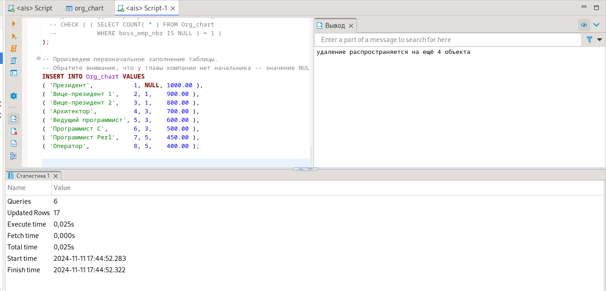
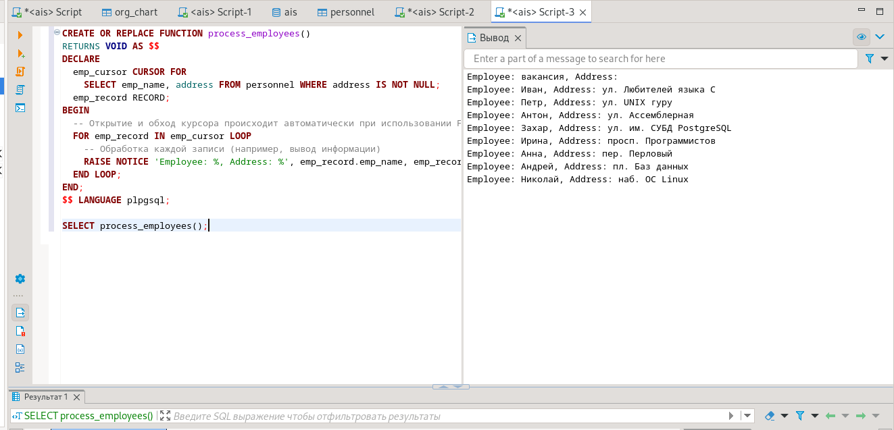

# Лабораторная работа №10

Тема: Администрирование из книги [lab-10/inf-book-task.pdf](./inf-book-task.pdf)

Группа: М8О-109СВ-24

Выполнил: **Гимазетдинов Дмитрий Русланович**

[*вернуться на главную*](./../README.md)

---

## Подготовка

### Дано: 

Создать базу данных и дополнить ее информацией

```sql
createdb ais -U postgres
psql -d ais -f adj_list.sql -U postgres
```

### Вывод:

```bash
root@debian:/home/cube# psql -d ais -f /home/cube/Документы/mai/s1/bd/inf_sys_admin_prg/UTF-8/adj_list.sql -U postgres
psql:/home/cube/Документы/mai/s1/bd/inf_sys_admin_prg/UTF-8/adj_list.sql:21: ЗАМЕЧАНИЕ:  таблица "personnel" не существует, пропускается
DROP TABLE
CREATE TABLE
INSERT 0 9
psql:/home/cube/Документы/mai/s1/bd/inf_sys_admin_prg/UTF-8/adj_list.sql:48: ЗАМЕЧАНИЕ:  таблица "org_chart" не существует, пропускается
DROP TABLE
CREATE TABLE
INSERT 0 8
CREATE FUNCTION
psql:/home/cube/Документы/mai/s1/bd/inf_sys_admin_prg/UTF-8/adj_list.sql:174: ЗАМЕЧАНИЕ:  триггер "check_org_chart" для отношения "org_chart" не существует, пропускается
DROP TRIGGER
CREATE TRIGGER
CREATE FUNCTION
CREATE FUNCTION
CREATE FUNCTION
CREATE FUNCTION
psql:/home/cube/Документы/mai/s1/bd/inf_sys_admin_prg/UTF-8/adj_list.sql:453: ЗАМЕЧАНИЕ:  представление "personnel_org_chart" не существует, пропускается
DROP VIEW
CREATE VIEW
psql:/home/cube/Документы/mai/s1/bd/inf_sys_admin_prg/UTF-8/adj_list.sql:483: ЗАМЕЧАНИЕ:  представление "create_paths" не существует, пропускается
DROP VIEW
CREATE VIEW
CREATE FUNCTION
```

## Задание 12

### Дано: 

Выполнить запросы:

```sql
psql -d ais -с "SELECT * FROM Personnel"
psql -d ais -с "SELECT * FROM Org_chart"
psql -d ais -с "SELECT * FROM Personnel_org_chart"
psql -d ais -с "SELECT * FROM Create_paths"
```

### Вывод:

**Personnel:**

|emp_nbr|emp_name|address|birth_date|
|-------|--------|-------|----------|
|0|вакансия||2014-05-19|
|1|Иван|ул. Любителей языка C|1962-12-01|
|2|Петр|ул. UNIX гуру|1965-10-21|
|3|Антон|ул. Ассемблерная|1964-04-17|
|4|Захар|ул. им. СУБД PostgreSQL|1963-09-27|
|5|Ирина|просп. Программистов|1968-05-12|
|6|Анна|пер. Перловый|1969-03-20|
|7|Андрей|пл. Баз данных|1945-11-07|
|8|Николай|наб. ОС Linux|1944-12-01|

**Org_chart:**

|job_title|emp_nbr|boss_emp_nbr|salary|
|---------|-------|------------|------|
|Президент|1||1000.0000|
|Вице-президент 1|2|1|900.0000|
|Вице-президент 2|3|1|800.0000|
|Архитектор|4|3|700.0000|
|Ведущий программист|5|3|600.0000|
|Программист C|6|3|500.0000|
|Программист Perl|7|5|450.0000|
|Оператор|8|5|400.0000|

**Personnel_org_chart:**

|emp_nbr|emp|boss_emp_nbr|boss|
|-------|---|------------|----|
|1|Иван|||
|2|Петр|1|Иван|
|3|Антон|1|Иван|
|4|Захар|3|Антон|
|5|Ирина|3|Антон|
|6|Анна|3|Антон|
|7|Андрей|5|Ирина|
|8|Николай|5|Ирина|

**Create_paths:**

|level1|level2|level3|level4|
|------|------|------|------|
|Иван|Антон|Ирина|Андрей|
|Иван|Антон|Ирина|Николай|
|Иван|Петр|||
|Иван|Антон|Захар||
|Иван|Антон|Анна||

## Задание 13

### Дано: 

Выполнить запуск функции:

```sql
SELECT * FROM tree_test();
```

Создать короткий и длинный цикл в `Org_chart`:

### Вывод:

|tree_test|
|---------|
|Tree|


Изменим нашу таблицу и сделаем цикл:

|job_title|emp_nbr|boss_emp_nbr|salary|
|---------|-------|------------|------|
|Президент|1||1000.0000|
|Вице-президент 1|2|1|900.0000|
|Вице-президент 2|3|4|800.0000|
|Архитектор|4|3|700.0000|
|Ведущий программист|5|3|600.0000|
|Программист C|6|3|500.0000|
|Программист Perl|7|5|450.0000|
|Оператор|8|2|400.0000|

Получаем вывод:

|tree_test|
|---------|
|Cycles|

Аналогично с длинным циклом

## Задание 14

### Дано: 

Выполнить запуск функции:

```sql
SELECT * FROM up_tree_traversal( 6 );
```
попробовать поменять вершину.

Теперь заменить функцию на другую:

```sql
SELECT * FROM up_tree_traversal( ( SELECT emp_nbr FROM Personnel
WHERE emp_name == 'Иван') );
```


### Вывод:

Там где я проставил цикл, на третьем элементе, программа зацикливается, т.к. там используется функция `while`, поменяв начальную вершину, можно получить следующие результаты:

```sql
SELECT * FROM up_tree_traversal( 1 );
```

|emp_nbr|boss_emp_nbr|
|-------|------------|
|1||


```sql
SELECT * FROM up_tree_traversal( ( SELECT emp_nbr FROM Personnel
WHERE emp_name == 'Иван') );
```

|emp_nbr|boss_emp_nbr|
|-------|------------|
|1||


## Задание 15

### Дано: 

Выполните операцию удаления поддерева с помощью функции `delete_subtree()`. Параметром функции является код работника.

```sql
SELECT * FROM delete_subtree( 3 );
```

или по имени

```sql
SELECT * FROM delete_subtree( ( SELECT emp_nbr FROM Personnel
WHERE emp_name == 'Антон') );
```

Рассмотреть структуру `Personnel_org_chart` и `Create_paths` после удаления!


### Вывод:

После выполнения запроса:

`Personnel_org_chart`

|emp_nbr|emp|boss_emp_nbr|boss|
|-------|---|------------|----|
|2|Петр|1|Иван|
|8|Николай|2|Петр|
|1|Иван|||

`Create_paths`

|level1|level2|level3|level4|
|------|------|------|------|
|Иван|Петр|Николай||


## Задание 16

### Дано: 

Если в таблице «Организационная структура» осталось мало данных, то дополните ее данными и выполните удаление элемента иерархии и продвижение дочерних элементов на один уровень вверх (т. е. к «бабушке»).

```sql
SELECT * FROM delete_and_promote_subtree( 5 );
```

Аналогично работе с функцией up_tree_traversal() используйте подзапрос для получения кода работника по его имени. После удаления элемента иерархии посмотрите, что стало с организационной структурой, с помощью двух представлений `Personnel_org_chart` и `Create_paths`.


### Вывод:

просто обновим запись:



|emp_nbr|emp_name|address|birth_date|
|-------|--------|-------|----------|
|0|вакансия||2014-05-19|
|1|Иван|ул. Любителей языка C|1962-12-01|
|2|Петр|ул. UNIX гуру|1965-10-21|
|3|Антон|ул. Ассемблерная|1964-04-17|
|4|Захар|ул. им. СУБД PostgreSQL|1963-09-27|
|5|Ирина|просп. Программистов|1968-05-12|
|6|Анна|пер. Перловый|1969-03-20|
|7|Андрей|пл. Баз данных|1945-11-07|
|8|Николай|наб. ОС Linux|1944-12-01|

Посмотрим, что стало с структурой двух представлений `Personnel_org_chart` и `Create_paths`:

|emp_nbr|emp|boss_emp_nbr|boss|
|-------|---|------------|----|
|1|Иван|||
|2|Петр|1|Иван|
|3|Антон|1|Иван|
|4|Захар|3|Антон|
|6|Анна|3|Антон|
|7|Андрей|3|Антон|
|8|Николай|3|Антон|

|level1|level2|level3|level4|
|------|------|------|------|
|Иван|Петр|||
|Иван|Антон|Захар||
|Иван|Антон|Николай||
|Иван|Антон|Анна||
|Иван|Антон|Андрей||


## Задание 17

### Дано: 

Представление Create_paths позволяет отобразить только
четыре уровня иерархии. Модифицируйте его так, чтобы оно могло
работать с пятью уровнями иерархии

### Вывод:

Модернизация:

```sql
DROP VIEW IF EXISTS Create_paths;

CREATE VIEW Create_paths (level1, level2, level3, level4, level5) AS
  SELECT O1.emp AS e1, O2.emp AS e2, O3.emp AS e3, O4.emp AS e4, O5.emp AS e5
  FROM Personnel_org_chart AS O1
  LEFT OUTER JOIN Personnel_org_chart AS O2 ON O1.emp = O2.boss
  LEFT OUTER JOIN Personnel_org_chart AS O3 ON O2.emp = O3.boss
  LEFT OUTER JOIN Personnel_org_chart AS O4 ON O3.emp = O4.boss
  LEFT OUTER JOIN Personnel_org_chart AS O5 ON O4.emp = O5.boss
  WHERE O1.emp = 'Иван';
```

|level1|level2|level3|level4|level5|
|------|------|------|------|------|
|Иван|Антон|Андрей|||
|Иван|Антон|Анна|||
|Иван|Антон|Николай|||
|Иван|Антон|Захар|||
|Иван|Петр||||


## Задание 18

### Дано: 

Самостоятельно ознакомьтесь с таким средством работы
с таблицами базы данных, как курсоры (cursors). Воспользуйтесь тех-
нической документацией на PostgreSQL, глава «PL/pgSQL – SQL
Procedural Language». Напишите небольшую функцию с применением
курсора.

### Вывод:




