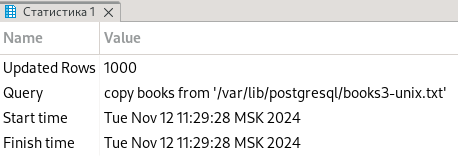

 Лабораторная работа №11

Тема: Полнотекстовый поиск.

Группа: М8О-109СВ-24

Выполнил: **Гимазетдинов Дмитрий Русланович**

[*вернуться на главную*](./../README.md)

---

## Подготовка

Создадим тестовую БД `search`:

```bash
postgres=# create database search;
CREATE DATABASE
postgres=# \c search 
You are now connected to database "search" as user "postgres".
search=# 
```

Создадим таблицу и скопируем данные из файла:

```sql
create table books 
(
	book_id integer primary key,
	book_description text
);

copy books from '/var/lib/postgresql/books3-unix.txt';
```



Добавим поле для индексации:

```sql
ALTER TABLE books ADD COLUMN ts_description tsvector;
UPDATE books
   SET ts_description = to_tsvector(
                            'russian',
                            book_description 
                        );
```

Отображение части данных:

|book_id|book_description|ts_description|
|-------|----------------|--------------|
|1|Любанович, Билл. Простой Python [Текст] : современный стиль программирования / Билл Любанович. - Санкт-Петербург ; Москва ; Екатеринбург : Питер, 2018. - 476 с.|'2018':17 '476':18 'python':4 'билл':2,9 'екатеринбург':15 'любанович':1,10 'москв':14 'петербург':13 'питер':16 'программирован':8 'прост':3 'санкт':12 'санкт-петербург':11 'современ':6 'стил':7 'текст':5|
|2|Робсон, Элизабет. Изучаем HTML, XHTML и CSS [Текст] / Элизабет Робсон, Эрик Фримен ; [пер. с англ. В. Черник]. - Москва ; Санкт-Петербург ; Нижний Новгород : Питер, 2017. - 718 с.|'2017':25 '718':26 'css':7 'html':4 'xhtml':5 'англ':15 'изуча':3 'москв':18 'нижн':22 'новгород':23 'пер':13 'петербург':21 'питер':24 'робсон':1,10 'санкт':20 'санкт-петербург':19 'текст':8 'фрим':12 'черник':17 'элизабет':2,9 'эрик':11|
|3|Бхаргава, Адитья. Грокаем алгоритмы [Текст] : иллюстрированное пособие для программистов и любопытствующих / Адитья Бхаргава ; [пер. с англ. Е. Матвеев]. - Санкт-Петербург : Питер, 2017. - 288 с.|'2017':23 '288':24 'адит':2,12 'алгоритм':4 'англ':16 'бхаргав':1,13 'грока':3 'е':17 'иллюстрирова':6 'любопытств':11 'матве':18 'пер':14 'петербург':21 'питер':22 'пособ':7 'программист':9 'санкт':20 'санкт-петербург':19 'текст':5|
|4|Пассиг, Катрин. Программирование без дураков [Текст] / Катрин Пассиг, Йоханнес Яндер ; [пер. с нем. Е. Зазноба и др.]. - Санкт-Петербург : Питер, 2017. - 416 с.|'2017':22 '416':23 'др':17 'дурак':5 'е':14 'зазноб':15 'йоханнес':9 'катрин':2,7 'нем':13 'пассиг':1,8 'пер':11 'петербург':20 'питер':21 'программирован':3 'санкт':19 'санкт-петербург':18 'текст':6 'яндер':10|
|5|Попов, Владимир Борисович. Паскаль для школьников [Текст] : учебное пособие / В. Б. Попов. - Москва : РИОР : ИНФРА-М, 2018. - 372, [1] с.|'1':20 '2018':18 '372':19 'б':11 'борисович':3 'владимир':2 'инфр':16 'инфра-м':15 'м':17 'москв':13 'паскал':4 'поп':1,12 'пособ':9 'риор':14 'текст':7 'учебн':8 'школьник':6|
|6|Ночка, Евгений Иванович. Основы алгоритмизации и программирования (на языке Питон) [Текст] : учебник : [для студентов среднего профессионального образования по направлениям подготовки 2.09.02.01 "Компьютерные системы и комплексы", 2.09.02.04 "Информационные системы (по отраслям)"] / Е. И. Ночка. - Москва : Курс, 2018. - 203, [1] с.|'1':38 '2.09.02.01':21 '2.09.02.04':26 '2018':36 '203':37 'алгоритмизац':5 'е':31 'евген':2 'иванович':3 'информацион':27 'комплекс':25 'компьютерн':22 'курс':35 'москв':34 'направлен':19 'ночк':1,33 'образован':17 'основ':4 'отрасл':30 'питон':10 'подготовк':20 'программирован':7 'профессиональн':16 'систем':23,28 'средн':15 'студент':14 'текст':11 'учебник':12 'язык':9|
|7|Фризен, Ирина Григорьевна. Основы алгоритмизации и программирования (среда PascalABC.NET) [Текст] : учебное пособие : [для учебных заведений, реализующих программу среднего профессионального образования по специальностям 09.02.04 "Информационные системы (по отраслям)", 09.02.03 "Программирование в компьютерных системах"] / И. Г. Фризен. - Москва : ФОРУМ : ИНФРА-М, 2017. - 390, [1] с.|'09.02.03':28 '09.02.04':23 '1':43 '2017':41 '390':42 'pascalabc.net':9 'алгоритмизац':5 'г':34 'григорьевн':3 'заведен':15 'информацион':24 'инфр':39 'инфра-м':38 'ирин':2 'компьютерн':31 'м':40 'москв':36 'образован':20 'основ':4 'отрасл':27 'пособ':12 'программ':17 'программирован':7,29 'профессиональн':19 'реализ':16 'систем':25,32 'специальн':22 'сред':8 'средн':18 'текст':10 'учебн':11,14 'форум':37 'фриз':1,35|
|8|Шустова, Лариса Ивановна. Базы данных [Текст] : учебник : [для студентов по направлению подготовки 09.03.03 "Прикладная информатика" (квалификация (степень) "бакалавр")] / Л. И. Шустова, О. В. Тараканов. - Москва : ИНфра-М, 2017. - 302, [1] с.|'09.03.03':13 '1':31 '2017':29 '302':30 'баз':4 'бакалавр':18 'дан':5 'ивановн':3 'информатик':15 'инфр':27 'инфра-м':26 'квалификац':16 'л':19 'ларис':2 'м':28 'москв':25 'направлен':11 'подготовк':12 'прикладн':14 'степен':17 'студент':9 'таракан':24 'текст':6 'учебник':7 'шустов':1,21|
|9|Бэндлер, Ричард. Большая энциклопедия НЛП [Текст] : структура магии / Ричард Бэндлер, Джон Гриндер. - Москва : Прайм : АСТ, 2016. - 445 с.|'2016':16 '445':17 'аст':15 'больш':3 'бэндлер':1,10 'гриндер':12 'джон':11 'маг':8 'москв':13 'нлп':5 'прайм':14 'ричард':2,9 'структур':7 'текст':6 'энциклопед':4|
|10|Шлее, Макс. Qt 5.10. Профессиональное программирование на C++ [Текст] : [наиболее полное руководство : для программистов] / М. Шлее. - Санкт-Петербург : БХВ-Петербург, 2018. - XX, 1052 с.|'1052':25 '2018':23 '5.10':4 'c':8 'qt':3 'xx':24 'бхв':21 'бхв-петербург':20 'м':15 'макс':2 'наибол':10 'петербург':19,22 'полн':11 'программирован':6 'программист':14 'профессиональн':5 'руководств':12 'санкт':18 'санкт-петербург':17 'текст':9 'шле':1,16|
|...|...|...|

Попробуем провести выборку:

```sql
select * from books where ts_description @@ to_tsquery('Pascal');
```

|book_id|book_description|ts_description|
|-------|----------------|--------------|
|649|Немцова, Тамара Игоревна. Программирование на языке высокого уровня [Текст] : программирование на языке Object Pascal : [учебное пособие для студентов среднего профессионального образования по специальности "Информатика и вычислительная техника"] / Т. И. Немцова, С. Ю. Голова, И. В. Абрамова ; под ред. Л. Г. Гагариной. - Москва : ФОРУМ : ИНФРА-М, 2012. - 495 с.|'2012':47 '495':48 'object':13 'pascal':14 'абрамов':36 'высок':7 'вычислительн':26 'г':40 'гагарин':41 'голов':33 'игоревн':3 'информатик':24 'инфр':45 'инфра-м':44 'л':39 'м':46 'москв':42 'немцов':1,30 'образован':21 'пособ':16 'программирован':4,10 'профессиональн':20 'ред':38 'специальн':23 'средн':19 'студент':18 'т':28 'тамар':2 'текст':9 'техник':27 'уровн':8 'учебн':15 'форум':43 'ю':32 'язык':6,12|
|872|Визуализация моделируемых процессов средствами Pascal [Текст] : учебно-методическая разработка / М-во образования и науки Рос. Федерации, Краснояр. гос. пед. ун-т им. В. П. Астафьева. - Красноярск : КГПУ им. В. П. Астафьева, 2010. - 33, [1] с.|'1':37 '2010':35 '33':36 'pascal':5 'астафьев':28,34 'визуализац':1 'гос':20 'кгпу':30 'краснояр':19 'красноярск':29 'м':12 'м-во':11 'методическ':9 'моделируем':2 'наук':16 'образован':14 'п':27,33 'пед':21 'процесс':3 'разработк':10 'рос':17 'средств':4 'т':24 'текст':6 'ун':23 'ун-т':22 'учебн':8 'учебно-методическ':7 'федерац':18|
|894|Немнюгин С. Изучаем Turbo Pascal [Текст] / С. Немнюгин, Л. Перколаб. - Санкт-Петербург : Питер, 2003. - 309 с.|'2003':15 '309':16 'pascal':5 'turbo':4 'изуча':3 'л':9 'немнюгин':1,8 'перколаб':10 'петербург':13 'питер':14 'санкт':12 'санкт-петербург':11 'текст':6|
