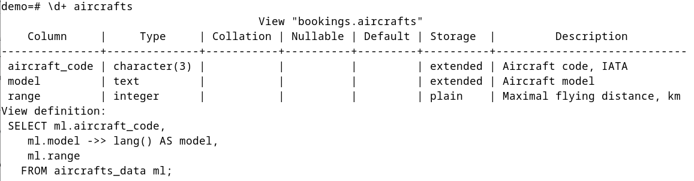
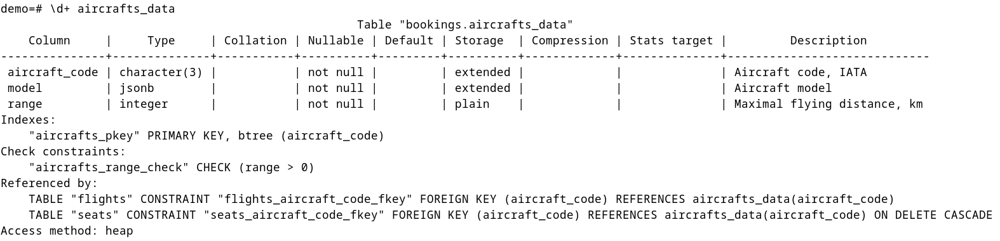

# Лабораторная работа №2 

Тема: Глава 3 из [книги](https://edu.postgrespro.ru/sql_primer.pdf). Упр 1-4.

Группа: М8О-109СВ-24

Выполнил: **Гимазетдинов Дмитрий Русланович**

---

## Упражнение 1
### Дано:

Попробуйте ввести в таблицу `aircrafts` строку с таким значением атрибута «Код самолета» (`aircraft_code`), которое вы уже вводили, например:

```sql
INSERT INTO aircrafts
VALUES ( 'SU9', 'Sukhoi SuperJet-100', 3000 );
```

Вы получите сообщение об ошибке.

```bash
ОШИБКА: повторяющееся значение ключа нарушает ограничение
уникальности "aircrafts_pkey"
ПОДРОБНОСТИ: Ключ "(aircraft_code)=(SU9)" уже существует.
```
Подумайте, почему появилось сообщение. Если вы забыли структуру таблицы `aircrafts`, то можно вывести ее определение на экран с помощью команды

```code
postgres=# \d aircrafts
```

### Решение:

1. Запустим терминал `psql` от имени пользователя `postgres`.
   
    Команды:
   - Текущее соединение:
    ```bash
    postgres=# \c
    ```
    *You are now connected to database "postgres" as user "postgres".*

   - Подключиться к базе данных `demo`:
    ```bash
    postgres=# \c demo
    ```
    *You are now connected to database "demo" as user "postgres".*

2. Рассмотрим структуру `aircrafts`:

```code
                View "bookings.aircrafts"
    Column     |     Type     | Collation | Nullable | Default 
--------------+--------------+-----------+----------+---------
aircraft_code | character(3) |           |          | 
model         | text         |           |          | 
range         | integer      |           |          | 
``` 

3. Рассмотрим запрос создания вьюшки `aircrafts`, которая служит для того, чтобы быть мультиязыковой:



Эта вьюшка создана на основе `aircrafts_data`:

4. Рассмотрим ее 



Поле `aircraft_code` является сурргогатным первичным ключом, а первичный ключ должен быть уникальным. Пожтому и была ошибка.