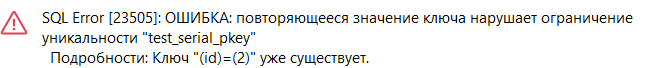

# Лабораторная работа №3

Тема: Глава 4 из [книги](https://edu.postgrespro.ru/sql_primer.pdf). Упр 2, 4, 8, 12, 15, 21, 30, 33, 35.

Группа: М8О-109СВ-24

Выполнил: **Гимазетдинов Дмитрий Русланович**

[*вернуться на главную*](./../README.md)

---

## Упражнение 2
### Дано:

Предположим, что возникла необходимость хранить в одном столбце таблицы данные, представленные с различной точностью. Это могут быть, например, результаты физических измерений разнородных показателей или различные медицинские показатели здоровья пациентов (результаты анализов). В таком случае можно использовать тип `numeric` без указания масштаба и точности.

Команда для создания таблицы может быть, например, такой:

```sql
CREATE TABLE test_numeric (
    measurement numeric,
    description text
); 
```

Если у вас в базе данных уже есть таблица с таким же именем, то можно предварительно ее удалить с помощью команды

```sql
DROP TABLE test_numeric;
```

Вставьте в таблицу несколько строк:

```sql
INSERT INTO test_numeric
    VALUES ( 1234567890.0987654321, 
            'Точность 20 знаков, масштаб 10 знаков' );

INSERT INTO test_numeric
    VALUES ( 1.5,
            'Точность 2 знака, масштаб 1 знак' );

INSERT INTO test_numeric
    VALUES ( 0.12345678901234567890,
            'Точность 21 знак, масштаб 20 знаков' );

INSERT INTO test_numeric
    VALUES ( 1234567890,
            'Точность 10 знаков, масштаб 0 знаков (целое число)' );
```

Теперь сделайте выборку из таблицы и посмотрите, что все эти разнообразные значения сохранены именно в том виде, как вы их вводили.

### Решение

Создадим схему `test` и в ней таблицу `new_test_numeric`, а так же перейдем в схему

СОЗДАНИЕ:
```bash
demo=# create schema test;
CREATE SCHEMA
demo=# create table test.new_test_numeric
(                  
        measurement numeric,
        description text
);
CREATE TABLE
```

ПЕРЕКЛЮЧЕНИЕ И ПРОСМОТР:
```bash
demo=# SET search_path TO test;
SET
demo=# \d+
                                           List of relations
 Schema |       Name       | Type  |  Owner   | Persistence | Access method |    Size    | Description 
--------+------------------+-------+----------+-------------+---------------+------------+-------------
 test   | new_test_numeric | table | postgres | permanent   | heap          | 8192 bytes | 
(1 row)
```

Теперь заполним, данными как сказано в задании и выполним запрос.

```sql
select * from new_test_numeric;
```

```bash
      measurement       |                    description                     
------------------------+----------------------------------------------------
  1234567890.0987654321 | Точность 20 знаков, масштаб 10 знаков
                    1.5 | Точность 2 знака, масштаб 1 знак
 0.12345678901234567890 | Точность 21 знак, масштаб 20 знаков
             1234567890 | Точность 10 знаков, масштаб 0 знаков (целое число)
(4 rows)
```

Как видно, все числа сохранили свою значимую информацию и влезли в numeric.

---

## Упражнение 4
### Дано:

Проведите аналогичные эксперименты с очень большими числами, находящимися на границе допустимого диапазона для чисел типов `real` и `double precision`.

### Решение:

Выполним запросы над очень большими числами, на границе их точности, и просмотрим результат. Для этого выполним следующий запрос:

```sql
SELECT '3.4e+38'::real > '3.3999999e+38'::real AS test1,
       '1.8e+307'::double precision > '1.7999999999999999e+307'::double precision AS test2,
       '3.4e+38'::real = '3.3999999e+38'::real AS test3,
       '1.8e+307'::double precision = '1.7999999999999999e+307'::double precision AS test4,
       '1.8e+307'::double precision AS test5,
       '3.4e+38'::real AS test6;
```

Получаем следующий вывод:

```bash
 test1 | test2 | test3 | test4 |  test5   |  test6  
-------+-------+-------+-------+----------+---------
 f     | f     | t     | t     | 1.8e+307 | 3.4e+38
(1 row)
```

Как видно, результаты довольно не очевидны!
А именно операция сравнения идет очень не точно.

---

## Упражнение 8
### Дано:

Выполнить операции из списка и сказать почему появилась дыра при использовании первичного ключа.

### Решение:

Создадим таблицу

```sql
CREATE TABLE test_serial (
    id serial PRIMARY KEY,
    name text
);
```

И выполним очевидные операции заполнения по порядку.

```sql
INSERT INTO test_serial ( name ) VALUES ( 'Вишневая' );
```

```sql
INSERT INTO test_serial ( id, name ) VALUES ( 2, 'Прохладная' );
```

```sql
INSERT INTO test_serial ( name ) VALUES ( 'Грушевая' );
```

На этом шаге мы получили ошибку:



**Это случилось потому что**:
Тип данных сериал - это тип данных у которого под капотом стоит итератор, который при обращение к нему дает следующее уникальное число, и в прошлом шаге мы самостоятельно дали индекс для поля, поэтому при автоматическом вызвался `id=2`, которое уже существует!

```sql
INSERT INTO test_serial ( name ) VALUES ( 'Грушевая' );
```

```sql
INSERT INTO test_serial ( name ) VALUES ( 'Зеленая' );
```


```sql
DELETE FROM test_serial WHERE id = 4;
```

```sql
INSERT INTO test_serial ( name ) VALUES ( 'Луговая' );
```

```sql
SELECT * FROM test_serial;
```

И получаем на выходе следующий результат:

```bash
 id | name
----+------------
  1 | Вишневая
  2 | Прохладная
  3 | Грушевая
  5 | Луговая
(4 строки)
```

Пропустилась запись с номером `4`. Это случилось потом что после удаления итератор serial продолжает свою работу и для последней записи *'Луговая'* он присваивает значение `5`.

---

## Упражнение 12
### Дано:

Формат ввода и вывода даты можно изменить с помощью конфигурационного параметра `datestyle`. Значение этого параметра состоит из двух компонентов: первый управляет форматом вывода даты, а второй регулирует порядок следования составных частей даты (год, месяц, день) при вводе и выводе. Текущее значение этого параметра можно узнать с помощью команды `SHOW`:

```sql
SHOW datestyle;
```

По умолчанию он имеет такое значение:

```bash
DateStyle
-----------
ISO, DMY
(1 строка)
```

Продемонстрируем влияние этого параметра на работу с типами данных `date` и `timestamp`. Для экспериментов возьмем дату, в которой число (день) превышает 12, чтобы нельзя было день перепутать с номером месяца. Пусть это будет, например, ***18 мая 2016 г***.

```sql
SELECT '18-05-2016'::date;
```

В ответ получим сообщение об ошибке. Если бы мы выбрали дату, в которой число (день) было бы не больше 12, например, 9, то сообщение об ошибке не было бы сформировано, т. е. мы с такой датой не смогли бы проиллюстрировать влияние значения `DMY` параметра `datestyle`. Но главное, что в таком случае мы бы просто не заметили допущенной ошибки.

А вот использовать порядок «год, месяц, день» при вводе можно несмотря на то, что параметр `datestyle` предписывает «день, месяц, год». Порядок «год, месяц, день» является универсальным, его можно использовать всегда, независимо от настроек параметра `datestyle`

```sql
SELECT '2016-05-18'::date;
```

```bash
date
------------
2016-05-18
(1 строка)
```

Продолжим экспериментирование с параметром datestyle. Давайте изменим его значение. Сделать это можно многими способами, но мы упомянем лишь некоторые:

- изменив его значение в конфигурационном файле postgresql.conf, который в нашей инсталляции PostgreSQL, описанной в главе 2, находится в каталоге /usr/local/pgsql/data;
- назначив переменную системного окружения PGDATESTYLE;
- воспользовавшись командой SET.

Сейчас выберем третий способ, а первые два рассмотрим при выполнении других заданий. Поскольку параметр `datestyle` состоит фактически из двух частей, которые можно задавать не только обе сразу, но и по отдельности, изменим только порядок следования составных частей даты, не изменяя формат вывода с `ISO` на какой-либо другой.

```sql
SET datestyle TO 'MDY';
```

Повторим одну из команд, выполненных ранее. Теперь она должна вызвать ошибку. Почему?

```sql
SELECT '18-05-2016'::date;
```

А такая команда, наоборот, теперь будет успешно выполнена:

```sql
SELECT '05-18-2016'::date;
```

Теперь приведите настройку параметра datestyle в исходное состояние:

```sql
SET datestyle TO DEFAULT;
```

Самостоятельно выполните команды `SELECT`, приведенные выше, но замените в них тип `date` на тип `timestamp`. Вы увидите, что дата в рамках типа `timestamp` обрабатывается аналогично типу `date`.

Сейчас изменим сразу обе части параметра `datestyle`:

```sql
SET datestyle TO 'Postgres, DMY';
```

Проверьте полученный результат с помощью команды `SHOW`. 
Самостоятельно выполните команды `SELECT`, приведенные выше, как для значения типа date, так и для значения типа `timestamp`. Обратите внимание, что если выбран формат Postgres, то порядок следования составных частей даты (день, месяц, год), заданный в параметре `datestyle`, используется не только при вводе значений, но и при выводе. Напомним, что вводом мы считаем команду `SELECT`, а выводом — результат ее выполнения, выведенный на экран.

В документации (см. раздел 8.5.2 «Вывод даты/времени») сказано, что формат вывода даты может принимать значения ISO, Postgres, SQL и German. Первые два варианта мы уже рассмотрели. Самостоятельно поэкспериментируйте с двумя оставшимися по той же схеме, по которой вы уже действовали ранее при выполнении этого задания. Можно воспользоваться и стандартными функциями `current_date` и `current_timestamp`.

### Решение:

Узнаем текущее состояние конфигурационного параметра `datastyle`:

```sql
SHOW datestyle;
```

Получаем:

```bash
postgres=# SHOW datestyle;
 DateStyle 
-----------
 ISO, DMY
(1 row)
```

Для эксперимента возьмем дату, в которой день превышает 12 например `18-03-2024`.

Выполним следующие команды:

```bash
postgres=# select '18-03-2024'::date;
    date    
------------
 2024-03-18
(1 row)
```

Введем дату в пордке `mm-dd-yyyy`:

```bash
postgres=# select '03-18-2024'::date;
ОШИБКА:  значение поля типа date/time вне диапазона: "03-18-2024"
СТРОКА 1: select '03-18-2024'::date;
                 ^
ПОДСКАЗКА:  Возможно, вам нужно изменить настройку "datestyle".
```

Это все зависит от параметра `DMY`, который предписывает формат `dd-mm-yyyy`, но стандартный формат `sql - yyyy:mm:dd` работает безпринципно:

```bash
postgres=# select '2024-03-18'::date;
    date    
------------
 2024-03-18
(1 row)

```

Изменим параметр `datestyle`:

```sql
SET datestyle TO 'MDY';
```

И выполним запрос:

```bash
postgres=# select '18-03-2024'::date;
ОШИБКА:  значение поля типа date/time вне диапазона: "18-03-2024"
СТРОКА 1: select '18-03-2024'::date;
                 ^
ПОДСКАЗКА:  Возможно, вам нужно изменить настройку "datestyle".
```

как мы видим прошлый наш запрос, который до этого выполнялся, не выполнился.

Вернем в исходное состояние

```sql
SET datestyle TO DEFAULT;
```

Повторим наши опыты для `timestamp`:

```bash
postgres=# select '18-03-2024'::timestamp;
      timestamp      
---------------------
 2024-03-18 00:00:00
(1 row)

postgres=# select '03-18-2024'::timestamp;
ОШИБКА:  значение поля типа date/time вне диапазона: "03-18-2024"
СТРОКА 1: select '03-18-2024'::timestamp;
ПОДСКАЗКА:  Возможно, вам нужно изменить настройку "datestyle".

postgres=# select '2024-03-18'::timestamp;
      timestamp      
---------------------
 2024-03-18 00:00:00
(1 row)

postgres=# 
```

**Результаты аналогичны!**

Попробуем новый формат `ISO`:

```sql
SET datestyle TO 'ISO';
```

```bash
postgres=# select '18-03-2024'::timestamp;
      timestamp      
---------------------
 2024-03-18 00:00:00
(1 row)

postgres=# select '03-18-2024'::timestamp;
ОШИБКА:  значение поля типа date/time вне диапазона: "03-18-2024"
СТРОКА 1: select '03-18-2024'::timestamp;
                 ^
ПОДСКАЗКА:  Возможно, вам нужно изменить настройку "datestyle".
postgres=# select '2024-03-18'::timestamp;
      timestamp      
---------------------
 2024-03-18 00:00:00
(1 row)

postgres=# 
```

Следующее

```sql
SET datestyle TO 'SQL';
```

```bash
postgres=# select '18-03-2024'::timestamp;
      timestamp      
---------------------
 18/03/2024 00:00:00
(1 row)

postgres=# select '03-18-2024'::timestamp;
ОШИБКА:  значение поля типа date/time вне диапазона: "03-18-2024"
СТРОКА 1: select '03-18-2024'::timestamp;
                 ^
ПОДСКАЗКА:  Возможно, вам нужно изменить настройку "datestyle".
postgres=# select '2024-03-18'::timestamp;
      timestamp      
---------------------
 18/03/2024 00:00:00
(1 row)

postgres=# 
```

Формат вывода у нас изменился!

Теперь следующий формат:

```sql
SET datestyle TO 'German';
```

```bash
postgres=# select '18-03-2024'::timestamp;
      timestamp      
---------------------
 18.03.2024 00:00:00
(1 row)

postgres=# select '03-18-2024'::timestamp;
ОШИБКА:  значение поля типа date/time вне диапазона: "03-18-2024"
СТРОКА 1: select '03-18-2024'::timestamp;
                 ^
ПОДСКАЗКА:  Возможно, вам нужно изменить настройку "datestyle".
postgres=# select '2024-03-18'::timestamp;
      timestamp      
---------------------
 18.03.2024 00:00:00
(1 row)

postgres=# 
```

И тут формат данных у нас изменился!

Не забудем вернуть в исходное:

```bash
postgres=# SET datestyle TO DEFAULT;
SET
```


---

## Упражнение 15
### Дано:
В документации в разделе 9.8 «Функции форматирования данных» представлены описания множества полезных функций, позволяющих преобразовать в строку данные других типов, например, `timestamp`. Одна из таких функций — `to_char`.
Поэкспериментируйте с этой функцией, извлекая из значения типа `timestamp` различные поля и располагая их в нужном вам порядке.

### Решение:

Проведем эксперименты над этой функцией!

Запрос 1
```sql
select to_char(current_timestamp, 'MONTH');
```
Результат 1:
```bash
  to_char  
-----------
 SEPTEMBER
(1 row)
```

Запрос 2:
```sql
select to_char(current_timestamp, 'IW');
```
(номер недели в году по ISO 8601 (01–53; первый четверг года относится к неделе 1))
Результат 2:
```bash
 to_char 
---------
 39
(1 row)
```

Запрос 3:
```sql
select to_char(current_timestamp, 'J CC Q dd:mm:yyyy');
```
Параметры
- J – Юлианская дата
- CC – Век
- Q – Квартал
 
Результат 3:
```bash
         to_char         
-------------------------
 2460579 21 3 25:09:2024
(1 row)
```

---

## Упражнение 21
### Дано:
Можно с высокой степенью уверенности предположить, что при прибавлении интервалов к датам и временным отметкам PostgreSQL учитывает тот факт, ´ что различные месяцы имеют различное число дней. Но как это реализуется на практике? Например, что получится при прибавлении интервала в 1 месяц к последнему дню января и к последнему дню февраля? Сначала сделайте обоснованные предположения о результатах следующих двух команд, а затем проверьте предположения на практике и проанализируйте полученные результаты:
```sql
SELECT ( '2016-01-31'::date + '1 mon'::interval ) AS new_date;
SELECT ( '2016-02-29'::date + '1 mon'::interval ) AS new_date;
```

### Решение:

> Я думаю. Что добавление интервала в один месяц просто увеличивает номер месяца, если идет переполнение по дню, то оставляет самый максимальный для этого месяца.

Теперь можем это проверить!
Запустим:

```sql
SELECT ( '2016-01-31'::date + '1 mon'::interval ) AS new_date,
       ( '2016-02-29'::date + '1 mon'::interval ) AS new_date_2;
```
```bash
      new_date       |     new_date_2      
---------------------+---------------------
 2016-02-29 00:00:00 | 2016-03-29 00:00:00
(1 row)
```

---

## Упражнение 30
### Дано:
Обратимся к таблице, создаваемой с помощью команды
```sql
CREATE TABLE test_bool
( 
    a boolean,
    b text
);
```
Как вы думаете, какие из приведенных ниже команд содержат ошибку?

```sql
INSERT INTO test_bool VALUES ( TRUE, 'yes' );
INSERT INTO test_bool VALUES ( yes, 'yes' );
INSERT INTO test_bool VALUES ( 'yes', true );
INSERT INTO test_bool VALUES ( 'yes', TRUE );
INSERT INTO test_bool VALUES ( '1', 'true' );
INSERT INTO test_bool VALUES ( 1, 'true' );
INSERT INTO test_bool VALUES ( 't', 'true' );
INSERT INTO test_bool VALUES ( 't', truth );
INSERT INTO test_bool VALUES ( true, true );
INSERT INTO test_bool VALUES ( 1::boolean, 'true' );
INSERT INTO test_bool VALUES ( 111::boolean, 'true' );
```

Проверьте свои предположения практически, выполнив эти команды.

### Решение:

Заустим приведу `log` из `bash`:
```bash
demo=# INSERT INTO test_bool VALUES ( TRUE, 'yes' );
INSERT INTO test_bool VALUES ( yes, 'yes' );
INSERT INTO test_bool VALUES ( 'yes', true );
INSERT INTO test_bool VALUES ( 'yes', TRUE );
INSERT INTO test_bool VALUES ( '1', 'true' );
INSERT INTO test_bool VALUES ( 1, 'true' );
INSERT INTO test_bool VALUES ( 't', 'true' );
INSERT INTO test_bool VALUES ( 't', truth );
INSERT INTO test_bool VALUES ( true, true );
INSERT INTO test_bool VALUES ( 1::boolean, 'true' );
INSERT INTO test_bool VALUES ( 111::boolean, 'true' );
INSERT 0 1
ОШИБКА:  столбец "yes" не существует
СТРОКА 1: INSERT INTO test_bool VALUES ( yes, 'yes' );
                                         ^
INSERT 0 1
INSERT 0 1
INSERT 0 1
ОШИБКА:  столбец "a" имеет тип boolean, а выражение - integer
СТРОКА 1: INSERT INTO test_bool VALUES ( 1, 'true' );
                                         ^
ПОДСКАЗКА:  Перепишите выражение или преобразуйте его тип.
INSERT 0 1
ОШИБКА:  столбец "truth" не существует
СТРОКА 1: INSERT INTO test_bool VALUES ( 't', truth );
                                              ^
INSERT 0 1
INSERT 0 1
INSERT 0 1
```

Запишем результаты в табличку и попытаемся их осмыслить!

| Запустились                                           | Не запустились                                               |
|-------------------------------------------------------|--------------------------------------------------------------|
| INSERT INTO test_bool VALUES ( TRUE, 'yes' );         | INSERT INTO test_bool VALUES ( yes, 'yes' );                 |
| INSERT INTO test_bool VALUES ( 'yes', true );         | INSERT INTO test_bool VALUES ( 1, 'true' );                  |
| INSERT INTO test_bool VALUES ( 'yes', TRUE );         | INSERT INTO test_bool VALUES ( 't', truth );                 |
| INSERT INTO test_bool VALUES ( '1', 'true' );         |                                                              |
| INSERT INTO test_bool VALUES ( 't', 'true' );         |                                                              |
| INSERT INTO test_bool VALUES ( true, true );          |                                                              |
| INSERT INTO test_bool VALUES ( 1::boolean, 'true' );  |                                                              |
| INSERT INTO test_bool VALUES ( 111::boolean, 'true' );|                                                              |

Что мы получили?
Сделаем выборку:
```bash
demo=# select * from test_bool b;
 a |  b   
---+------
 t | yes
 t | true
 t | true
 t | true
 t | true
 t | true
 t | true
 t | true
(8 rows)
```

- В первом **тип** `yes` не существует
  
- Во втором `integer` вместо `boolean`
  
- В третьем `truth` **не известный** тип данных

---

## Упражнение 33
### Дано:

Предположим, что руководство авиакомпании решило, что пища пилотов должна быть разнообразной. Оно позволило им выбрать свой рацион на каждый из четырех дней недели, в которые пилоты совершают полеты. Для нас это решение руководства выливается в необходимость модифицировать таблицу, а именно: столбец meal теперь будет содержать двумерные массивы. Определение этого столбца станет таким: meal text[][].
**Задание.** Создайте новую версию таблицы и соответственно измените команду INSERT, чтобы в ней содержались литералы двумерных массивов. Они будут
выглядеть примерно так:
```sql
'{ { "сосиска", "макароны", "кофе" },
   { "котлета", "каша", "кофе" },
   { "сосиска", "каша", "кофе" },
   { "котлета", "каша", "чай" } }'::text[][]
```
Сделайте ряд выборок и обновлений строк в этой таблице. Для обращения к элементам двумерного массива нужно использовать два индекса. Не забывайте, что по умолчанию номера индексов начинаются с единицы.

### Решение:

Перейдем в БД `edu` и посмотрим ее содержимое:

```bash
postgres=# \c edu
You are now connected to database "edu" as user "postgres".
edu=# \d
 public | progress | table | postgres
 public | students | table | postgres
```

Создадим таблицу пилотов:

```sql
CREATE TABLE pilots (
  pilot_name text,
  schedule integer[],
  meal text[][]
);
```

```bash
edu=# \d pilots
 pilot_name | text      |           |          | 
 schedule   | integer[] |           |          | 
 meal       | text[]    |           |          | 
```

Выполним `INSERT`

```sql
INSERT INTO pilots
VALUES ( 'Ivan', '{ 1, 3, 5, 6, 7 }'::integer[],
'{ { "сосиска", "макароны", "кофе" },
   { "котлета", "каша", "кофе" },
   { "сосиска", "каша", "кофе" },
   { "котлета", "каша", "чай" } }'::text[][]
),
( 'Petr', '{ 1, 2, 5, 7 }'::integer [],
'{ { "гречка", "сосиска", "молоко" },
   { "булочка", "котлета", "кефир" },
   { "гречка", "нагетсы", "кофе" },
   { "нагетсы", "каша", "кофе" } }'::text[][]
),
( 'Pavel', '{ 2, 5 }'::integer[],
'{ { "гречка", "сосиска", "молоко" },
   { "сосиска", "макароны", "кофе" },
   { "паста", "чипсы", "кофе" },
   { "котлета", "каша", "чай" } }'::text[][]
),
( 'Boris', '{ 3, 5, 6 }'::integer[],
'{ { "гречка", "сосиска", "молоко" },
   { "котлета", "курица", "кофе" },
   { "паста", "сухарики", "кофе" },
   { "сосиска", "макароны", "кофе" } }'::text[][]
);
```

Сделаем выборку по имени пилота и его приемам пищи:

```bash
edu=# select pilot_name, meal from pilots; 
 Ivan       | {{сосиска,макароны,кофе},{котлета,каша,кофе},{сосиска,каша,кофе},{котлета,каша,чай}}
 Petr       | {{гречка,сосиска,молоко},{булочка,котлета,кефир},{гречка,нагетсы,кофе},{нагетсы,каша,кофе}}
 Pavel      | {{гречка,сосиска,молоко},{сосиска,макароны,кофе},{паста,чипсы,кофе},{котлета,каша,чай}}
 Boris      | {{гречка,сосиска,молоко},{котлета,курица,кофе},{паста,сухарики,кофе},{сосиска,макароны,кофе}}
```

```bash
edu=# select meal[1:1] from pilots;
 {{сосиска,макароны,кофе}}
 {{гречка,сосиска,молоко}}
 {{гречка,сосиска,молоко}}
 {{гречка,сосиска,молоко}}
```

```sql
select 
  f.pilot_name, 
  f.m 
from ( 
  select 
    pilot_name, 
    unnest(meal) as m 
  from pilots
) as f 

where m = 'паста';
```

Получаем выбор пилотов, кто есть пасту!

```bash
 Pavel      | паста
 Boris      | паста
```

---

## Упражнение 35
### Дано:

Изучая приемы работы с типами JSON, можно, как и в случае с массивами, пользоваться способностью команды SELECT обходиться без создания таблиц.

Покажем лишь один пример. Добавить новый ключ и соответствующее ему значения в уже существующий объект можно оператором ||:

```bash
SELECT '{ "sports": "хоккей" }'::jsonb || '{ "trips": 5 }'::jsonb;
?column?
----------------------------------
{"trips": 5, "sports": "хоккей"}
(1 строка)
```

Для работы с типами JSON предусмотрено много различных функций и операторов, представленных в разделе документации 9.15 «Функции и операторы
JSON». Самостоятельно ознакомьтесь с ними, используя описанную технологию
работы с командой SELECT.

### Решение:

Содержит ли один `JSON` второй:

```bash
edu=# select '{"a":1, "b":2}'::jsonb @> '{"b":2}'::jsonb;
 t
```

Содержание ключа:

```bash
edu=# select '{"Маша":14, "Саша":17}'::jsonb ? 'Маша';
 t
```

Соединение двух `JSON`:

```bash
edu=# select '{"Маша":14, "Саша":17}'::jsonb || '{"Игорь":12, "Акакий":2}'::jsonb;
 {"Маша": 14, "Саша": 17, "Игорь": 12, "Акакий": 2}
```

Строка в `JSON`:
```bash
edu=# select row_to_json(row(1,'foo', true));
 {"f1":1,"f2":"foo","f3":true}
```

---