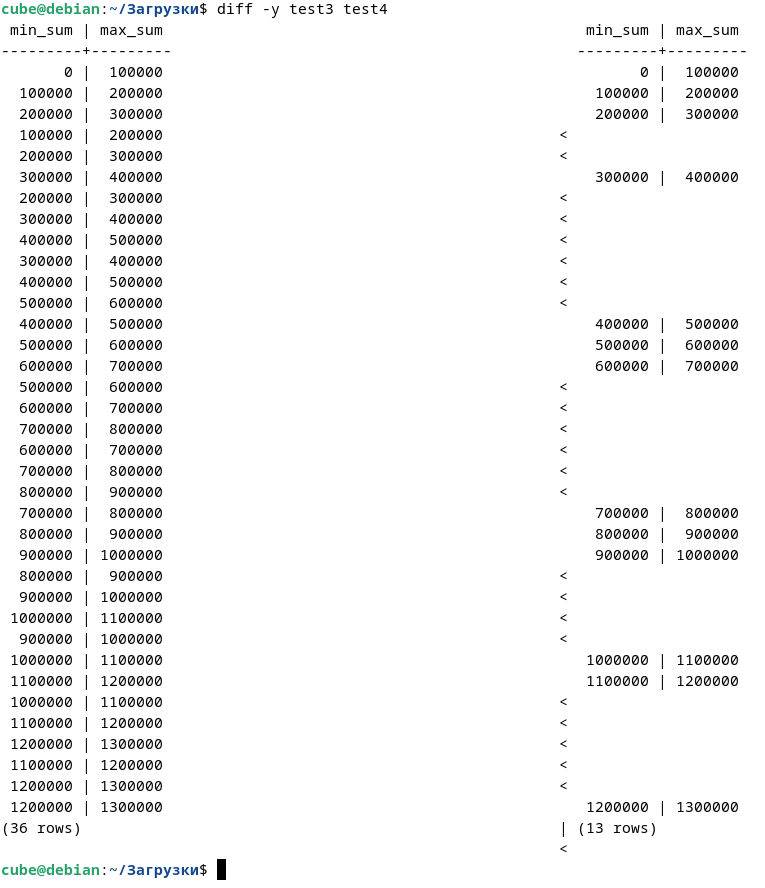

# Лабораторная работа №4

Тема: Глава 6 из [книги](https://edu.postgrespro.ru/sql_primer.pdf). Упр 2, 7, 9, 13, 19, 21, 23

Группа: М8О-109СВ-24

Выполнил: **Гимазетдинов Дмитрий Русланович**

---

## Упражнение 2
### Дано: 

Предложите шаблон поиска в операторе LIKE для выбора из этой таблицы всех пассажиров с фамилиями, состоящими из пяти букв.

### Решение:

```sql
select 
    passenger_name, 
    substring(passenger_name for position(' ' in passenger_name)) as name, 
    length(substring(passenger_name for position(' ' in passenger_name))) as size
 
  from tickets 
 where passenger_name like '_____ %';
```

Вывод:

```bash
   passenger_name   |  name  | size 
--------------------+--------+------
 FEDOR SHEVCHENKO   | FEDOR  |    6
 DAMIR TIMOFEEV     | DAMIR  |    6
 IRINA LUKYANOVA    | IRINA  |    6
 DARYA SIDOROVA     | DARYA  |    6
 ELENA MAKAROVA     | ELENA  |    6
 ILNAR SHEVCHENKO   | ILNAR  |    6
 VADIM KISELEV      | VADIM  |    6
 DENIS KUZNECOV     | DENIS  |    6
 ARTEM KISELEV      | ARTEM  |    6
 IRINA VOROBEVA     | IRINA  |    6
 YURIY NIKITIN      | YURIY  |    6
 TAGIR NIKOLAEV     | TAGIR  |    6
 IRINA ORLOVA       | IRINA  |    6
 ARTEM MAKAROV      | ARTEM  |    6
 YURIY VASILEV      | YURIY  |    6
 ARTEM POPOV        | ARTEM  |    6
 IRINA POPOVA       | IRINA  |    6
 ANAIT POPOVA       | ANAIT  |    6
 ROMAN ANDREEV      | ROMAN  |    6
 ARTUR GERASIMOV    | ARTUR  |    6
 ALINA VOLKOVA      | ALINA  |    6
 IRINA ANTONOVA     | IRINA  |    6
 ANTON BONDARENKO   | ANTON  |    6
 RAISA KONOVALOVA   | RAISA  |    6
 DENIS KUZNECOV     | DENIS  |    6
 YURIY MEDVEDEV     | YURIY  |    6
 PAVEL GUSEV        | PAVEL  |    6
 ELENA STEPANOVA    | ELENA  |    6
 RAISA ROMANOVA     | RAISA  |    6
 IRINA KAZAKOVA     | IRINA  |    6
 SOFYA DAVYDOVA     | SOFYA  |    6
 ROMAN BARANOV      | ROMAN  |    6
```

---

## Упражнение 7
### Дано:

Самые крупные самолеты в нашей авиакомпании — это Boeing 777-300. Выяснить, между какими парами городов они летают, поможет запрос:
```sql
SELECT DISTINCT departure_city, arrival_city
FROM routes r
JOIN aircrafts a ON r.aircraft_code = a.aircraft_code
WHERE a.model = 'Боинг 777-300'
ORDER BY 1;
```

```bash
 departure_city | arrival_city
----------------+--------------
   Екатеринбург | Москва
         Москва | Екатеринбург
         Москва | Новосибирск
         Москва | Пермь
         Москва | Сочи
    Новосибирск | Москва
          Пермь | Москва
           Сочи | Москва
(8 строк)
```

К сожалению, в этой выборке информация дублируется. Пары городов приведены по два раза: для рейса «туда» и для рейса «обратно». Модифицируйте запрос таким образом, чтобы каждая пара городов была выведена только один раз!

### Решение:

Идея заключается в том, что если у двух пар у которых есть рейс туда обратно городм отправления считать город, который лексикографичеси будет выше чем второй, а потом использовать `DISTINCT`, то мы сможем решить нашу проблему!

```sql
SELECT DISTINCT 
    LEAST(departure_city, arrival_city) AS departure_city,
    GREATEST(departure_city, arrival_city) AS arrival_city
FROM routes r
JOIN aircrafts a ON r.aircraft_code = a.aircraft_code
WHERE a.model = 'Боинг 777-300'
ORDER BY 1;
```

Посмотрим вывод:

```bash
 departure_city | arrival_city 
----------------+--------------
 Екатеринбург   | Москва
 Москва         | Новосибирск
 Москва         | Пермь
 Москва         | Сочи
(4 rows)
```
---

## Упражнение 9
### Дано:

Для ответа на вопрос, сколько рейсов выполняется из Москвы в Санкт-Петербург, можно написать совсем простой запрос:
```bash
SELECT count( * )
FROM routes
WHERE departure_city = 'Москва'
AND arrival_city = 'Санкт-Петербург';

count
-------
12
(1 строка)
```

А с помощью какого запроса можно получить результат в таком виде?

```bash
departure_city  | arrival_city    | count
----------------+-----------------+-------
Москва          | Санкт-Петербург | 12
(1 строка)
```

### Решение:

Можно сделать так:

```sql
SELECT distinct departure_city, arrival_city, count( * ) over()
FROM routes
WHERE departure_city = 'Москва'
AND arrival_city = 'Санкт-Петербург';

 departure_city |  arrival_city   | count 
----------------+-----------------+-------
 Москва         | Санкт-Петербург |    12
(1 row)
```

А можно сделать так:

```sql
SELECT departure_city, arrival_city, count( * )
FROM routes
WHERE departure_city = 'Москва'
AND arrival_city = 'Санкт-Петербург'
group by departure_city, arrival_city;

 departure_city |  arrival_city   | count 
----------------+-----------------+-------
 Москва         | Санкт-Петербург |    12
```

---

## Упражнение 13
### Дано:

Ответить на вопрос о том, каковы максимальные и минимальные цены билетов на все направления, может такой запрос:

```sql 
SELECT f.departure_city, 
       f.arrival_city,
       max( tf.amount ), 
       min( tf.amount )
FROM flights_v f
JOIN ticket_flights tf ON f.flight_id = tf.flight_id
GROUP BY 1, 2
ORDER BY 1, 2;
```

```bash
departure_city       | arrival_city        | max       | min
---------------------+---------------------+-----------+----------
Абакан               | Москва              | 101000.00 | 33700.00
Абакан               | Новосибирск         | 5800.00   | 5800.00
Абакан               | Томск               | 4900.00   | 4900.00
Анадырь              | Москва              | 185300.00 | 61800.00
Анадырь              | Хабаровск           | 92200.00  | 30700.00
...
(367 строк)
```

### Решение:

Обычный `JOIN` является пересечением двух таблиц, поэтому если в таблице `ticket_flights` нет записи, про какой-то рейс, то `JOIN` отсечет такие записи. Поэтому принудительно заставим для каждого полета отыскать запись в билетах, если такого нет появятся `NULL`!

Код:

```sql
SELECT f.departure_city, 
       f.arrival_city,
       max( tf.amount ), 
       min( tf.amount )
FROM flights_v f
LEFT JOIN ticket_flights tf ON f.flight_id = tf.flight_id
GROUP BY 1, 2                              
ORDER BY 1, 2;
```

```bash
      departure_city      |       arrival_city       |    max    |   min    
--------------------------+--------------------------+-----------+----------
 Абакан                   | Архангельск              |           |         
 Абакан                   | Грозный                  |           |         
 Абакан                   | Кызыл                    |           |         
 Абакан                   | Москва                   | 101000.00 | 33700.00
 Абакан                   | Новосибирск              |   5800.00 |  5800.00
 Абакан                   | Томск                    |   4900.00 |  4900.00
 Анадырь                  | Москва                   | 185300.00 | 61800.00
 Анадырь                  | Хабаровск                |  92200.00 | 30700.00
 Анапа                    | Белгород                 |  18900.00 |  6300.00
 Анапа                    | Москва                   |  36600.00 | 12200.00
 Анапа                    | Новокузнецк              |           |         
 Архангельск              | Абакан                   |           |         
 Архангельск              | Иркутск                  |           |         
 Архангельск              | Москва                   |  11100.00 | 10100.00
 Архангельск              | Нарьян-Мар               |   7300.00 |  6600.00
 Архангельск              | Пермь                    |  11000.00 | 11000.00
 Архангельск              | Томск                    |  28100.00 | 25500.00
 Архангельск              | Тюмень                   |  17100.00 | 15500.00
 Архангельск              | Ханты-Мансийск           |  16400.00 | 14900.00
 Астрахань                | Барнаул                  |  29000.00 | 26400.00
 Астрахань                | Москва                   |  14300.00 | 12400.00
 Астрахань                | Нерюнгри                 |           |         
 Барнаул                  | Астрахань                |  29000.00 | 26400.00
 Барнаул                  | Красноярск               |           |         
 Барнаул                  | Москва                   |  88300.00 | 29100.00
 ...
```

---

## Упражнение 19
### Дано:

```sql
WITH RECURSIVE ranges ( min_sum, max_sum )
AS (
    VALUES  ( 0, 100000 ),
            ( 100000, 200000 ),
            ( 200000, 300000 )
    UNION ALL
    SELECT min_sum + 100000, max_sum + 100000
    FROM ranges
    WHERE max_sum < ( SELECT max( total_amount ) FROM bookings )
)

SELECT * FROM ranges;
```

**Задание 1.** Модифицируйте запрос, добавив в него столбец level (можно назвать его и iteration). Этот столбец должен содержать номер текущей итерации, поэтому нужно увеличивать его значение на единицу на каждом шаге. Не забудьте задать начальное значение для добавленного столбца в предложении VALUES.

**Задание 2.** Для завершения экспериментов замените UNION ALL на UNION и выполните запрос. Сравните этот результат с предыдущим, когда мы использовали UNION ALL.

### Решение:

Модернизируем запрос:

```sql
WITH RECURSIVE ranges ( i, min_sum, max_sum )
AS (
    VALUES  ( 0, 0, 100000 ),
            ( 0, 100000, 200000 ),
            ( 0, 200000, 300000 )
    UNION ALL
    SELECT i + 1, min_sum + 100000, max_sum + 100000
    FROM ranges
    WHERE max_sum < ( SELECT max( total_amount ) FROM bookings )
)

SELECT * FROM ranges;
```

```bash
 i  | min_sum | max_sum 
----+---------+---------
  0 |       0 |  100000
  0 |  100000 |  200000
  0 |  200000 |  300000
  1 |  100000 |  200000
  1 |  200000 |  300000
  1 |  300000 |  400000
  2 |  200000 |  300000
  2 |  300000 |  400000
  2 |  400000 |  500000
  3 |  300000 |  400000
  3 |  400000 |  500000
  3 |  500000 |  600000
  4 |  400000 |  500000
  4 |  500000 |  600000
  4 |  600000 |  700000
  5 |  500000 |  600000
  5 |  600000 |  700000
  5 |  700000 |  800000
  6 |  600000 |  700000
  6 |  700000 |  800000
  6 |  800000 |  900000
  7 |  700000 |  800000
  7 |  800000 |  900000
  7 |  900000 | 1000000
  8 |  800000 |  900000
  8 |  900000 | 1000000
  8 | 1000000 | 1100000
  9 |  900000 | 1000000
  9 | 1000000 | 1100000
  9 | 1100000 | 1200000
 10 | 1000000 | 1100000
 10 | 1100000 | 1200000
 10 | 1200000 | 1300000
 11 | 1100000 | 1200000
 11 | 1200000 | 1300000
 12 | 1200000 | 1300000
(36 rows)
```

Замена `UNION ALL` -> `UNION`

```bash
WITH RECURSIVE ranges ( i, min_sum, max_sum )
AS (
    VALUES  ( 0, 0, 100000 ),
            ( 0, 100000, 200000 ),
            ( 0, 200000, 300000 )
    UNION    
    SELECT i + 1, min_sum + 100000, max_sum + 100000
    FROM ranges
    WHERE max_sum < ( SELECT max( total_amount ) FROM bookings )
)

SELECT * FROM ranges;
 i  | min_sum | max_sum 
----+---------+---------
  0 |       0 |  100000
  0 |  100000 |  200000
  0 |  200000 |  300000
  1 |  100000 |  200000
  1 |  200000 |  300000
  1 |  300000 |  400000
  2 |  200000 |  300000
  2 |  300000 |  400000
  2 |  400000 |  500000
  3 |  300000 |  400000
  3 |  400000 |  500000
  3 |  500000 |  600000
  4 |  400000 |  500000
  4 |  500000 |  600000
  4 |  600000 |  700000
  5 |  500000 |  600000
  5 |  600000 |  700000
  5 |  700000 |  800000
  6 |  600000 |  700000
  6 |  700000 |  800000
  6 |  800000 |  900000
  7 |  700000 |  800000
  7 |  800000 |  900000
  7 |  900000 | 1000000
  8 |  800000 |  900000
  8 |  900000 | 1000000
  8 | 1000000 | 1100000
  9 |  900000 | 1000000
  9 | 1000000 | 1100000
  9 | 1100000 | 1200000
 10 | 1000000 | 1100000
 10 | 1100000 | 1200000
 10 | 1200000 | 1300000
 11 | 1100000 | 1200000
 11 | 1200000 | 1300000
 12 | 1200000 | 1300000
(36 rows)
```

Сохраним вывод двух команд и используем ултилиту `linux-diff`:
```bash
cube@debian:~/Загрузки$ diff test1 test2
40d39
< 
```

Как видно файлы идентичны, потому что нет одинаковых строк, мешает идентификатор итерации. Проведем тот же опыт но для исходного запроса.



Это проиходит из-за того, что `union`, в отличие от `union all`, убирает все дублирующиеся строки!

---

## Упражнение 21
### Дано:

### Решение:


---

## Упражнение 23
### Дано:

### Решение:

---