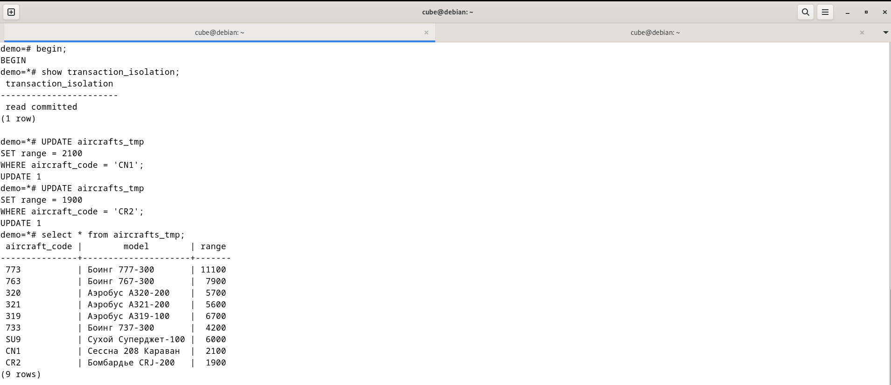
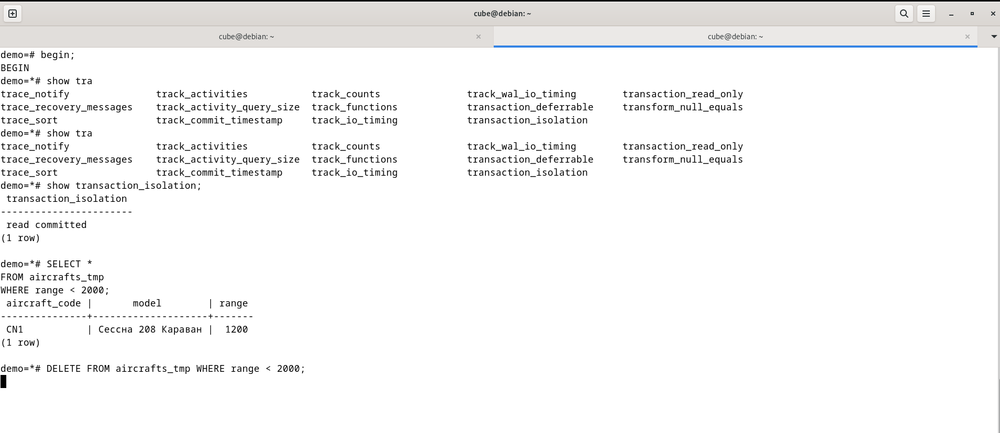

# Лабораторная работа №8

Тема: Глава 9 из [книги](https://edu.postgrespro.ru/sql_primer.pdf). Упр 2, 3

Группа: М8О-109СВ-24

Выполнил: **Гимазетдинов Дмитрий Русланович**

[*вернуться на главную*](./../README.md)

---

## Упражнение 2
### Дано: 

Транзакции, работающие на уровне изоляции Read Committed, видят только свои собственные обновления и обновления, зафиксированные параллельными транзакциями. При этом нужно учитывать, что иногда могут возникать ситуации, которые на первый взгляд кажутся парадоксальными, но на самом деле все происходит в строгом соответствии с этим принципом.

Воспользуемся таблицей «Самолеты» (aircrafts) или ее копией. Предположим, что мы решили удалить из таблицы те модели, дальность полета которых менее 2 000 км. В таблице представлена одна такая модель — Cessna 208 Caravan, имеющая дальность полета 1 200 км. Для выполнения удаления мы организовали транзакцию. Однако параллельная транзакция, которая, причем, началась раньше, успела обновить таблицу таким образом, что дальность полета самолета Cessna 208 Caravan стала составлять 2 100 км, а вот для самолета Bombardier CRJ-200 она, напротив, уменьшилась до 1 900 км. Таким образом, в результате выполнения операций обновления в таблице по-прежнему присутствует строка, удовлетворяющая первоначальному условию, т. е. значение атрибута range у которой меньше 2000.
Наша задача: проверить, будет ли в результате выполнения двух транзакций удалена какая-либо строка из таблицы.

На первом терминале начнем транзакцию, при этом уровень изоляции Read Committed в команде указывать не будем, т. к. он принят по умолчанию:

```sql
BEGIN;
```

```sql
SELECT *
FROM aircrafts_tmp
WHERE range < 2000;
```

```sql
UPDATE aircrafts_tmp
SET range = 2100
WHERE aircraft_code = 'CN1';
```

```sql
UPDATE aircrafts_tmp
SET range = 1900
WHERE aircraft_code = 'CR2';
```

На втором терминале начнем вторую транзакцию, которая и будет пытаться удалить строки, у которых значение атрибута range меньше 2000.

```sql
BEGIN;
```

```sql
SELECT *
FROM aircrafts_tmp
WHERE range < 2000;
```

```sql
DELETE FROM aircrafts_tmp WHERE range < 2000;
```

Введя команду DELETE, мы видим, что она не завершается, а ожидает, когда со строки, подлежащей удалению, будет снята блокировка. Блокировка, установленная командой UPDATE в первой транзакции, снимается только при завершении транзакции, а завершение может иметь два исхода: фиксацию изменений с помощью команды COMMIT (или END) или отмену изменений с помощью команды ROLLBACK.

Давайте зафиксируем изменения, выполненные первой транзакцией. На первом терминале сделаем так:

```sql
COMMIT;
```

Тогда на втором терминале мы получим такой результат от команды DELETE:

```bash
DELETE 0
```

Чем объясняется такой результат? Он кажется нелогичным: ведь команда SELECT, выполненная в этой же второй транзакции, показывала наличие строки, удовлетворяющей условию удаления.
Объяснение таково: поскольку вторая транзакция пока еще не видит изменений, произведенных в первой транзакции, то команда DELETE выбирает для удаления строку, описывающую модель Cessna 208 Caravan, однако эта строка была заблокирована в первой транзакции командой UPDATE. Эта команда изменила значение атрибута range в этой строке.

При завершении первой транзакции блокировка с этой строки снимается (со второй строки — тоже), и команда DELETE во второй транзакции получает воз- можность заблокировать эту строку. При этом команда DELETE данную строку перечитывает и вновь вычисляет условие WHERE применительно к ней. Однако теперь условие WHERE для данной строки уже не выполняется, следовательно, эту строку удалять нельзя. Конечно, в таблице есть теперь другая строка, для самолета Bombardier CRJ-200, удовлетворяющая условию удаления, однако повторный поиск строк, удовлетворяющих условию WHERE в команде DELETE, не производится.

В результате не удаляется ни одна строка. Таким образом, к сожалению, имеет место нарушение согласованности, которое можно объяснить деталями реализации СУБД.

Завершим вторую транзакцию:

```sql
END;
```

**Задание.** Модифицируйте сценарий выполнения транзакций: в первой транзакции вместо фиксации изменений выполните их отмену с помощью команды ROLLBACK и посмотрите, будет ли удалена строка и какая конкретно.

### Решение:

Создадим транзакцию (`bash-1`) и выполним команды обновления в таблице `aircrafts_tmp`:



 Теперь проведем новую транзакцию для второго пользователя (`bash-2`):



 Как видим, выполнение второй транзакции застыла, т.к. мы заблокировали доступ на изменения первой транзакцией!

 Теперь отменим первую транзакцию:

 ```bash
bash-1
demo=*# rollback;
ROLLBACK
```

```bash
demo=*# DELETE FROM aircrafts_tmp WHERE range < 2000;
DELETE 1
```

На втором терминале, мы получили успешное выполнение команды. Один элемент удален. Давайте посмотрим какой именнон:


Удалилась нужная строка!!!

---

## Упражнение 3
### Дано: 

Когда говорят о таком феномене, как потерянное обновление, то зачастую в качестве примера приводится операция UPDATE, в которой значение какого-то атрибута изменяется с применением одного из действий арифметики. Например:

```sql
UPDATE aircrafts_tmp
SET range = range + 200
WHERE aircraft_code = 'CR2';
```

При выполнении двух и более подобных обновлений в рамках параллельных транзакций, использующих, например, уровень изоляции Read Committed, будут учтены все такие изменения (что и было показано в тексте главы). Очевидно, что потерянного обновления не происходит.

Предположим, что в одной транзакции будет просто присваиваться новое значение, например, так:

```sql
UPDATE aircrafts_tmp
SET range = 2100
WHERE aircraft_code = 'CR2';
```

А в параллельной транзакции будет выполняться аналогичная команда:

```sql
UPDATE aircrafts_tmp
SET range = 2500
WHERE aircraft_code = 'CR2';
```

Очевидно, что сохранится только одно из значений атрибута range. Можно ли говорить, что в такой ситуации имеет место потерянное обновление? Если оно имеет место, то что можно предпринять для его недопущения? Обоснуйте ваш ответ.


### Решение:


---